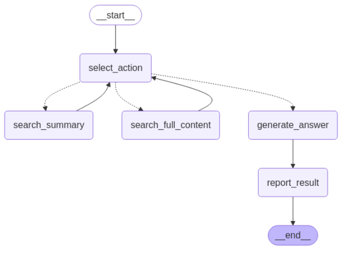

# Hierarchical RAG System

A sophisticated Retrieval-Augmented Generation (RAG) system with a hierarchical architecture that efficiently processes and retrieves information from a large document corpus.

## Architecture Overview

This system implements a two-layer hierarchical approach:

1. **Summary Layer**: High-level document summaries for efficient first-pass retrieval
2. **Content Layer**: Detailed content chunks for in-depth information retrieval

## Key Components

- **Vector Storage**: Uses AstraDB to store vector embeddings of summaries and content.
- **Agent Workflow**: LangGraph-based multi-step decision process for RAG
- **Document Processing**: Ingests JSON documents, generates summaries, and chunks content
- **Hierarchical Search**: Searches summaries first, then content chunks when needed

## Setup Instructions

### Prerequisites

- Python 3.9+
- AstraDB account
- Gemini API key
- NEWSDATA API KEY
- sentence-transformers

### Installation

1. Clone this repository
2. Install dependencies:
   ```bash
   pip install -r requirements.txt
   ```
3. Create a `.env` file with your API keys:
   ```
   ASTRA_DB_TOKEN=your_astra_token
   ASTRA_DB_API_ENDPOINT=your_astra_endpoint
   OPENAI_API_KEY=your_openai_key
   ```

<!--## Usage-->

<!--### Data Ingestion-->

<!--```bash-->
<!--python main.py ingest /path/to/data.json-->
<!--```-->

<!--### Asking Questions-->

<!--```bash-->
<!--python main.py ask "What is the main topic discussed in the documents?"-->
<!--```-->

<!--### Interactive Mode-->

<!--```bash-->
<!--python main.py interactive-->
<!--```-->

## Scraped Data Format

This is the structure of the data which were scraped using Newsdata are in these following format\
The this type of data is stored into the AstraDB Vector database hosted in cloud:

```json
[
  {
    "url": "link of that news",
    "content": "News text content goes here...",
    "title": "News Title",
    "author": "Author Name",
    "date": "2023-04-01"
  }
]
```

## synthetic_pii_finance_multilingual Data Format

This is the structure of the synthetic_pii_finance_multilingual data which were downloaded from HuggingFace are in these following format\
The this type of data is stored into the AstraDB Vector database hosted in cloud:

```json
[
  {
    "url": "Unique Identifier",
    "document_type": "Type of the document",
    "language": "Language writen in",
    "domain": "Business domain",
    "expanded_description": "A summary of the generated text",
    "pii_spans": "some entity tags",
    "expanded_type": "High level document type",
    "generated_text": "Main content"
  }
]
```

## How It Works

- News and the synthetic_pii data are processed to extract content and metadata
- Summaries are generated using LLMs
- Content is chunked into smaller pieces
- sentence-transformers/all-mpnet-base-v2 was used to convert the text into embeddings

# AI Agent Documentation

## Overview

A context-aware AI agent that dynamically retrieves information and generates accurate responses without hallucinations. It uses an iterative search process to gather relevant data before formulating answers.

## Components

### 1. Select Action

**Purpose**: Decision engine for response strategy  
**Functionality**:

- Analyzes user questions to determine required context level
- Chooses between:
  - `search_summaries`: For broad conceptual understanding
  - `search_full_context`: For detailed technical information
- Manages iterative searches until sufficient data is collected

### 2. Search Summaries

**Purpose**: Rapid information scanning  
**Features**:

- Searches condensed knowledge sources
- Returns high-level overviews with source metadata
- Fast but limited detail

### 3. Search Full Context

**Purpose**: Deep information retrieval  
**Features**:

- Accesses complete documents/data sources
- Provides verbatim excerpts with precise references
- Slower but more comprehensive

### 4. Generate Answer

**Purpose**: Response synthesis  
**Functionality**:

- Combines validated assertions from search results
- Uses conversation history for context-aware responses
- Implements hallucination prevention through:
  - Source grounding
  - Contextual validation

## Workflow



# Fine-Tuned NER Model Documentation

## Overview

Custom Named Entity Recognition (NER) model built by fine-tuning LLaMA3.2-1B on synthetic_pii_finance_multilingual datasets. \
[Finetuned Model](https://huggingface.co/Arpx22/llama-3.2-1B-Finetuned-ner-finance/tree/main)

## Model Specifications

### Base Architecture

- **Foundation Model**: LLaMA3-21B
- **Modifications**:
  - Added custom loss function
  - used unsloth for finetuing

### Training Details

| Parameter       | Value                              |
| --------------- | ---------------------------------- |
| Training Data   | synthetic_pii_finance_multilingual |
| Training Epochs | 2                                  |
| Batch Size      | 32                                 |
| Learning Rate   | 3e-4                               |
| Optimizer       | adamw_8bit                         |
| Hardware        | NVIDIA T4                          |
| Training Time   | 30+ hours                          |

## Future Scope

The NER model can be used on top of the Agent to identify entities which might help to reduce the hallucinations.
